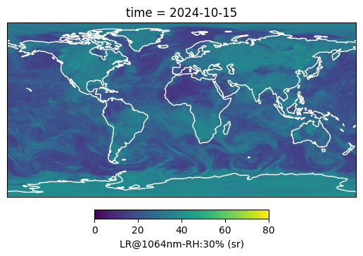
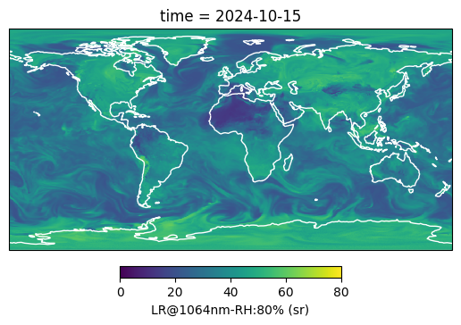

# aer-IFS

Compute aerosol optical properties maps based on [ECMWF IFS](https://www.ecmwf.int/en/forecasts/documentation-and-support/changes-ecmwf-model) forecasts.
- Lidar Ratio (LR)
- Mass to Extinction Coefficient (MEC, work in progress)

LR computation methodology:
- We get the IFS forecasts data of **aerosol optical depth** forecasts for the different chemical components.
- We get the IFS forecasts data of **relative humidity**.
- For each aerosol species, we calculate a **LR weighted** by the relative optical depth contribution for different RH values.
- The total LR is determined as the **sum of the weighted LR** of the different aerosols species.
  
Individual aerosol LR are taken from the [IFS 49R1](aer_ifs/config/aerosol_ifs_49R1_20230725.nc) input configuration file. For each species, a [specific column](aer_ifs/config/species_column.json) is selected, which might correspond to a specific range bins or according to the given literature reference.
 
## example

```
aer-ifs --date 2024-10-15
```

<figure>
  <div float="left">
    
    
  </div>
  <figcaption>Fig 1: IFS LR - 2024-10-15 - 1064 nm</figcaption>
</figure>


## get started

### 1. clone repo
```
git clone https://github.com/AugustinMortier/aer-ifs.git
```

### 2. install
- via poetry
```
poetry install
```

- via pip/pipx
```
pip install .
```

> [!NOTE]
> You can also install lr-ifs with this one liner:
> ```
> pip install "git+ssh://git@github.com/AugustinMortier/lr-ifs.git"
> ```

## how to use
Compute LR for the 2024-09-26

```
aer-ifs --date 2024-09-26
```

This will create into `output_path` (default: `./data/`):
- `{yyyy}/{mm}/lr_ifs-{yyyymmdd}.nc`: netcdf file which contains the computed LR.
- `{yyyy}/{mm}/lr_ifs-{yyyymmdd}.json` (if `aprofiles` option enabled (default)): json file which contains, for each E-PROFILE station available and for the selected day, the corresponding IFS-LR.

## limitations
- Only **one value per day** is computed at the moment and corresponds to **00:00:00Z**.
- Only **one value per column** is computed at the moment. Only the surface RH is considered for the calculation.
